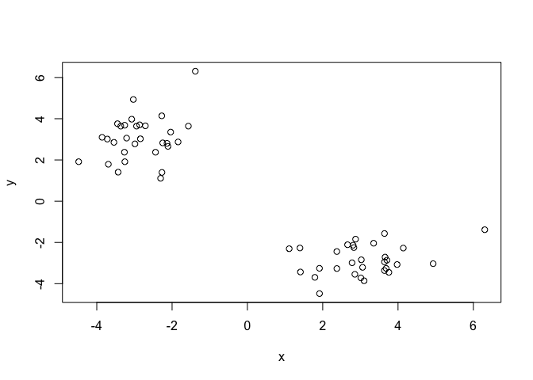
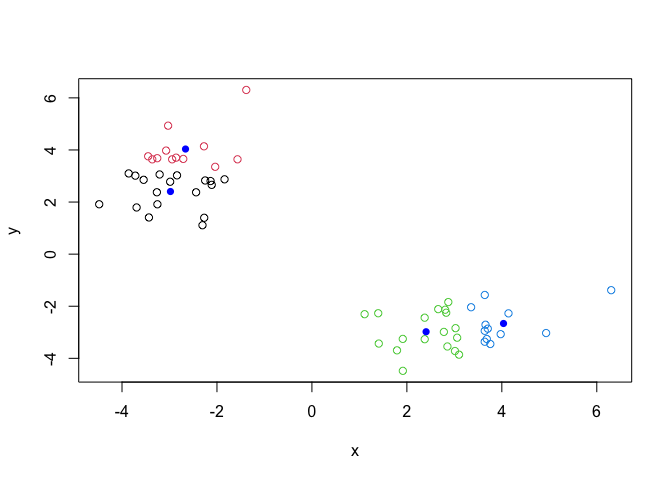
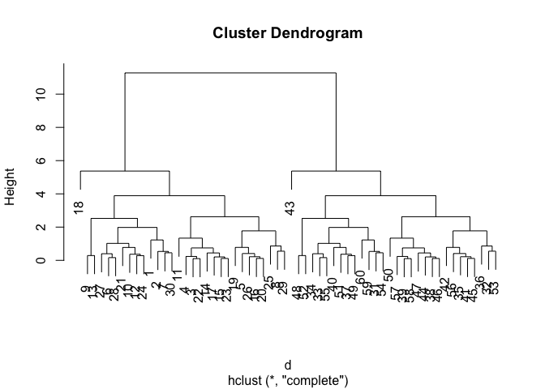

Class 7: Machine Learning 1
================
Kira

In this class we will explore clustering and dimensionality reduction
methods.

## K-means

Make up some input data where we know what the answer should be.

``` r
tmp <- c(rnorm(30, -3),rnorm(30,+3))
x <- cbind(x=tmp,y=rev(tmp))
head(x)
```

                 x        y
    [1,] -4.480421 1.915289
    [2,] -3.432842 1.408299
    [3,] -2.944082 3.640351
    [4,] -2.710120 3.655904
    [5,] -1.840367 2.872581
    [6,] -3.719225 3.013332

Quick plot of x to see the two groups at -3,+3 and +3,-3.

``` r
plot(x)
```



Use the `kmeans()` function, setting k to 2 and nstart=20.

``` r
km <- kmeans(x,centers=2,nstart=20)
km
```

    K-means clustering with 2 clusters of sizes 30, 30

    Cluster means:
              x         y
    1 -2.852692  3.057076
    2  3.057076 -2.852692

    Clustering vector:
     [1] 1 1 1 1 1 1 1 1 1 1 1 1 1 1 1 1 1 1 1 1 1 1 1 1 1 1 1 1 1 1 2 2 2 2 2 2 2 2
    [39] 2 2 2 2 2 2 2 2 2 2 2 2 2 2 2 2 2 2 2 2 2 2

    Within cluster sum of squares by cluster:
    [1] 49.05775 49.05775
     (between_SS / total_SS =  91.4 %)

    Available components:

    [1] "cluster"      "centers"      "totss"        "withinss"     "tot.withinss"
    [6] "betweenss"    "size"         "iter"         "ifault"      

> Q. How many points are in each cluster?

``` r
km$size
```

    [1] 30 30

> Q. What ‘component’ of your result object details cluster
> assignment/membership and cluster center?

``` r
km$cluster
```

     [1] 1 1 1 1 1 1 1 1 1 1 1 1 1 1 1 1 1 1 1 1 1 1 1 1 1 1 1 1 1 1 2 2 2 2 2 2 2 2
    [39] 2 2 2 2 2 2 2 2 2 2 2 2 2 2 2 2 2 2 2 2 2 2

``` r
km$centers
```

              x         y
    1 -2.852692  3.057076
    2  3.057076 -2.852692

> Q. Plot x colored by the kmeans cluster assignment and add cluster
> centers as blue points.

``` r
plot(x, col=km$cluster)
points(km$centers,col="blue", pch=15)
```


Play with kmeans and ask for different number of clusters.

``` r
km <- kmeans(x,centers=4,nstart=20)
plot(x, col=km$cluster)
points(km$centers,col="blue", pch=16)
```



# Hierarchical Clustering

This is another very useful and widely employed clustering method which
has the advantage over k-means in that is can help reveal something
about the true grouping in your data set.

The `hclust()` function wants a distance matrix as input. We can get
this from the `dist()` function.

``` r
d <- dist(x)
hc <- hclust(d)
hc
```


    Call:
    hclust(d = d)

    Cluster method   : complete 
    Distance         : euclidean 
    Number of objects: 60 

There is a plot method for `hclust()` results:

``` r
plot(hc)
abline(h=10,col="red")
```


To get my cluster membership vector I need to “cut” my tree to yield
sub-trees or branches with all the members of a given cluster. The
function to do this is called `cutree()`.

``` r
grps <- cutree(hc,h=10)
grps
```

     [1] 1 1 1 1 1 1 1 1 1 1 1 1 1 1 1 1 1 1 1 1 1 1 1 1 1 1 1 1 1 1 2 2 2 2 2 2 2 2
    [39] 2 2 2 2 2 2 2 2 2 2 2 2 2 2 2 2 2 2 2 2 2 2

``` r
plot(x,col=grps)
```


``` r
plot(hc)
```



It is often helpful to use the `k=` argument to `cutree()` rather than
the `h=` height of cutting with `cutree()`. This will cut the tree to
yield the number of clusters you want.

``` r
cutree(hc,k=4)
```

     [1] 1 1 1 1 1 1 1 1 1 1 1 1 1 1 1 1 1 2 1 1 1 1 1 1 1 1 1 1 1 1 3 3 3 3 3 3 3 3
    [39] 3 3 3 3 4 3 3 3 3 3 3 3 3 3 3 3 3 3 3 3 3 3

# Principal Component Analysis (PCA)

The base R function for PCA is called `prcomp()`. Let’s play with some
17D data (a very small dataset) and see how PCA can help.

# PCA of UK Food Data

Import the data

``` r
url <- "https://tinyurl.com/UK-foods"
x <- read.csv(url, row.names=1)
head(x)
```

                   England Wales Scotland N.Ireland
    Cheese             105   103      103        66
    Carcass_meat       245   227      242       267
    Other_meat         685   803      750       586
    Fish               147   160      122        93
    Fats_and_oils      193   235      184       209
    Sugars             156   175      147       139

> Q1. How many rows and columns are in your new data frame named x? What
> R functions could you use to answer this questions?

``` r
dim(x)
```

    [1] 17  4

I used the `dim()` function to find the number of columns and rows.

``` r
# Note how the minus indexing works
#rownames(x) <- x[,1]
#x <- x[,-1]
#head(x)
```

There are 17 rows and 4 columns once I adjusted it so that row-names was
not the first column.

> Q2. Which approach to solving the ‘row-names problem’ mentioned above
> do you prefer and why? Is one approach more robust than another under
> certain circumstances?

The second approach (fixing the problem when importing the data) is
probably ideal since running the `x <- x[-1]` multiple times will remove
a column each time. I have commented out these lines for subsequent runs
of code.

``` r
barplot(as.matrix(x), beside=F, col=rainbow(nrow(x)))
```


> Q3: Changing what optional argument in the above barplot() function
> results in the following plot?

Changing the “beside” argument to be “FALSE” or “F” changes the
`barplot()`. Leaving this argument out would have the same effect since
the default value for this argument is “FALSE”.

``` r
pairs(x, col=rainbow(10), pch=16)
```


> Q5: Generating all pairwise plots may help somewhat. Can you make
> sense of the following code and resulting figure? What does it mean if
> a given point lies on the diagonal for a given plot?

In this case, the pair-wise plots show comparisons between all countries
vs. all other countries in different food categories (i.e there is a
plot where each country is on the x-axis and another plot where it is on
the y-axis vs. all other countries). If a point lies on the diagonal of
a given plot, the two countries have the same value for that food
category.

> Q6. What is the main differences between N. Ireland and the other
> countries of the UK in terms of this data-set?

N. Ireland’s data is least similar to other countries in the dataset
(i.e values for respective food categories are not very often the same
between N. Ireland vs. England, Wales, or Scotland).

``` r
# Use the prcomp() PCA function 
pca <- prcomp( t(x) )
summary(pca)
```

    Importance of components:
                                PC1      PC2      PC3       PC4
    Standard deviation     324.1502 212.7478 73.87622 5.552e-14
    Proportion of Variance   0.6744   0.2905  0.03503 0.000e+00
    Cumulative Proportion    0.6744   0.9650  1.00000 1.000e+00

A “PCA plot”: PC1 vs. PC2

``` r
pca$x
```

                     PC1         PC2         PC3           PC4
    England   -144.99315    2.532999 -105.768945  1.042460e-14
    Wales     -240.52915  224.646925   56.475555  9.556806e-13
    Scotland   -91.86934 -286.081786   44.415495 -1.257152e-12
    N.Ireland  477.39164   58.901862    4.877895  2.872787e-13

> Q7. Complete the code below to generate a plot of PC1 vs PC2. The
> second line adds text labels over the data points.

``` r
# Plot PC1 vs PC2
plot(pca$x[,1], pca$x[,2], xlab="PC1", ylab="PC2", xlim=c(-270,500))
text(pca$x[,1], pca$x[,2], colnames(x))
```


> Q8. Customize your plot so that the colors of the country names match
> the colors in our UK and Ireland map and table at start of this
> document.

``` r
# Plot PC1 vs PC2 with country names colored
plot(pca$x[,1], pca$x[,2], xlab="PC1", ylab="PC2", xlim=c(-270,500))
text(pca$x[,1], pca$x[,2], colnames(x), col=c("orange", "red", "blue", "darkgreen"))
```


``` r
v <- round( pca$sdev^2/sum(pca$sdev^2) * 100 )
v
```

    [1] 67 29  4  0

``` r
z <- summary(pca)
z$importance
```

                                 PC1       PC2      PC3          PC4
    Standard deviation     324.15019 212.74780 73.87622 5.551558e-14
    Proportion of Variance   0.67444   0.29052  0.03503 0.000000e+00
    Cumulative Proportion    0.67444   0.96497  1.00000 1.000000e+00

``` r
barplot(v, xlab="Principal Component", ylab="Percent Variation")
```


``` r
## Lets focus on PC1 as it accounts for > 90% of variance 
par(mar=c(10, 3, 0.35, 0))
barplot( pca$rotation[,1], las=2 )
```


